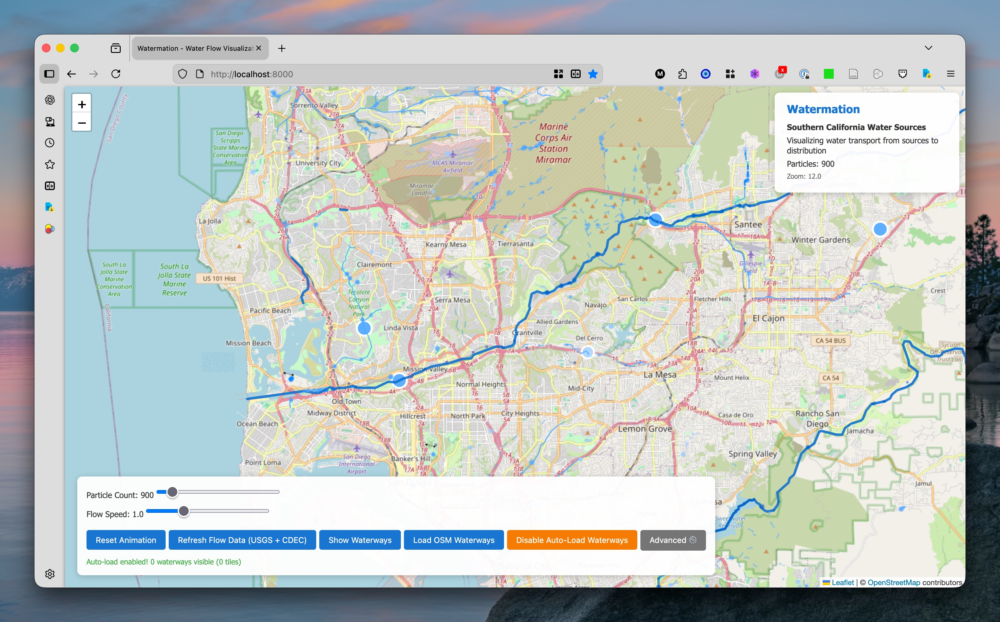

# Watermation - Southern California Water Flow Visualization

An interactive slippy map that animates water flow through Southern California's waterways using particle-based visualization.

### Why?
Being a lifelong SoCal resident, water has always been an important aspect of life. Water sourcing, conservation, recreation, politics, and quality. One major event that inspired me was participating in the Eastern Municipal Water District's Solar Cup engineering competition at Lake Skinner about a decade ago; it really opened my eyes to the world of resource management and the effort that goes on behind the scenes.

I'd also like to sharpen my geospatial skills and learn more about robust data visualization, web serving practices, and extracting useful insights.

## Features

- Visualize the velocity of waterways
- Slippy map that encourages exploration
- Take advantage of open water datasets
  - USGS monitoring stations (real-time flow data)
  - OpenStreetMap waterways (76,616 rivers, streams, canals)
- Use smart caching to serve resources locally as to not overwhelm any servers

## Data Sources

### 1. Static OSM Waterways
- **76,616 waterways** covering all of Southern California
- **File**: `data/socal_osm_waterways.geojson` (191MB uncompressed, 22MB gzipped)
- **Types**: rivers, streams, canals, drains
- **Coverage**: Southern California Bounding box (32.5°N to 35.5°N, -121°W to -114°W)

### 2. USGS Real-Time Data
- Monitoring station locations with current flow rates
- File: `data/usgs_ca_streamflow.json`

### 3. Custom Water Routes
- Major aqueducts and water infrastructure
- File: `data/socal_waterways.geojson`

## Waterway Colors

- **Rivers**: Deep blue (#0066cc)
- **Streams and Creeks**: Light blue (#4da6ff)
- **Canals**: Medium blue (#0088ff)
- **Drains**: Very light blue (#99ccff)

## License

Data sources maintain their original licenses:
- OpenStreetMap: ODbL
- USGS: Public Domain
